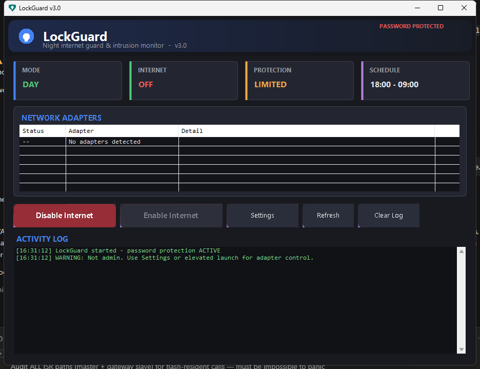
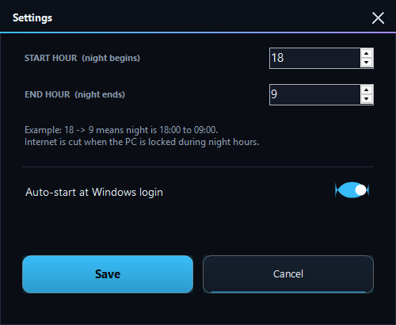

<div align="center">

# 🔒 LockGuard

**Password-protected night internet lock for Windows**

LockGuard cuts your internet connection automatically when your PC is locked at night — and requires a password you *and only you* know to bring it back.

[](https://github.com/ALeXXBody/LockGuard/releases)
[](https://dotnet.microsoft.com/download/dotnet-framework)
[](https://github.com/ALeXXBody/LockGuard/releases/latest)
[](LICENSE)

[](https://buymeacoffee.com/ALeXXBody)

</div>

---

## What it does

LockGuard lives in the system tray and watches Windows lock/unlock events:

- 🌙 **You lock your PC during night hours** → all physical network adapters are disabled. Internet gone.
- ☀️ **Morning comes** (or you unlock during the day) → adapters are re-enabled automatically.
- 🛡️ **Night unlock attempts are logged** as intrusion alerts and force-re-enable the connection for the user.
- 🔐 **Everything is password-gated** — disabling, enabling, changing settings, and even *exiting LockGuard* require the password. Wrong attempts are logged.

Use it to make "just five more minutes of YouTube" impossible for kids (or yourself) after bed time — locking the PC is the trigger, so a simple Windows key + L is enough.

## ✨ Features

| | |
|---|---|
| 🕛 **Flexible schedule** | Any night window, including overnight wrap (e.g. 18:00 → 09:00) plus a custom day window |
| 🔑 **Password protection** | Salted SHA-256 hashing; required for enable/disable, settings and exit |
| 👁️ **Intrusion monitoring** | Watches Windows security audit events for lock/unlock activity at night |
| 🖥️ **Futuristic dark UI** | Custom-drawn glass cards, status pills, live adapter view |
| 📋 **Activity log** | Every lock, intrusion attempt and action is timestamped |
| 🚀 **Silent install** | `LockGuard-1.0-Setup.exe /S` for unattended deployment |
| 🧹 **Clean uninstall** | Optional full removal of configuration, logs and scheduled task |

## 📸 Screenshots

<div align="center">
  
  
</div>

## 📥 Install

1. Grab **`LockGuard-1.0-Setup.exe`** from the [**latest release**](https://github.com/ALeXXBody/LockGuard/releases/latest)
2. Right-click → **Run as administrator** (the installer will request elevation via UAC)
3. Follow the wizard — it will:
   - Install to `C:\Program Files\LockGuard\`
   - Create Start Menu / Desktop shortcuts
   - Register a scheduled task to auto-start LockGuard at login
   - Enable the Windows audit policies needed for lock/unlock tracking
4. On first launch, set your **password** (min. 4 characters) and your **night window**

> **Command line:** `LockGuard-1.0-Setup.exe /S` performs a silent install.

## ⚙️ Usage

- Run LockGuard from the Start Menu or desktop shortcut. It minimizes to the **system tray**.
- **Lock PC (Win+L)** during night hours → internet is cut instantly.
- Internet is restored automatically in the morning, or on unlock during the day.
- Right-click the tray icon for quick actions and status.
- Default night window: **18:00 – 09:00** (configurable in Settings).

Notes:
- Adapter control needs **administrator rights** — LockGuard runs elevated via the scheduled task and will offer an elevated relaunch otherwise.
- The installer enables Windows audit policies (`Logon`, `Logoff`, `Special Logon`) so lock/unlock events appear in the Security log — that's how LockGuard detects locking.

## 🗑️ Uninstall

Uninstall from **Windows Settings → Apps** or the Start Menu shortcut. It stops LockGuard, removes the task, shortcuts and registry entries, and offers to delete your saved config/logs.

## 🛠️ Build from source

**Windows** (requires .NET Framework 4 + [NSIS](https://nsis.sourceforge.io) for the installer):

```powershell
cd src
powershell -ExecutionPolicy Bypass -File build.ps1
```

**Linux / CI** (cross-build, no Windows needed — requires `mono-mcs`, `binutils-mingw-w64`, `nsis`):

```bash
./installer/build.sh
# → src/LockGuard.exe + LockGuard-1.0-Setup.exe
```

The app is plain C# WinForms targeting .NET Framework 4.x — no external dependencies.

## 📁 Project structure

```
installer/
  LockGuard.nsi      NSIS installer script
  build.sh           Full Linux/CI build (windres → mcs → makensis)
src/
  LockGuard.cs       Application source (WinForms, single file)
  AssemblyInfo.cs    Assembly metadata
  LockGuard.manifest Application manifest (asInvoker, dpi-aware)
  build.ps1          Windows build script
  *.png              Screenshots
```

## ⚠️ Disclaimer

LockGuard controls network adapters but is **not anti-tamper software** — a determined user with admin rights can restore connectivity. It's designed to add friction, not to be a fortress.

If this tool saves you from doomscrolling past bed time, consider:

<div align="center">

<a href="https://buymeacoffee.com/ALeXXBody"></a>

</div>

## License

MIT © 2026
